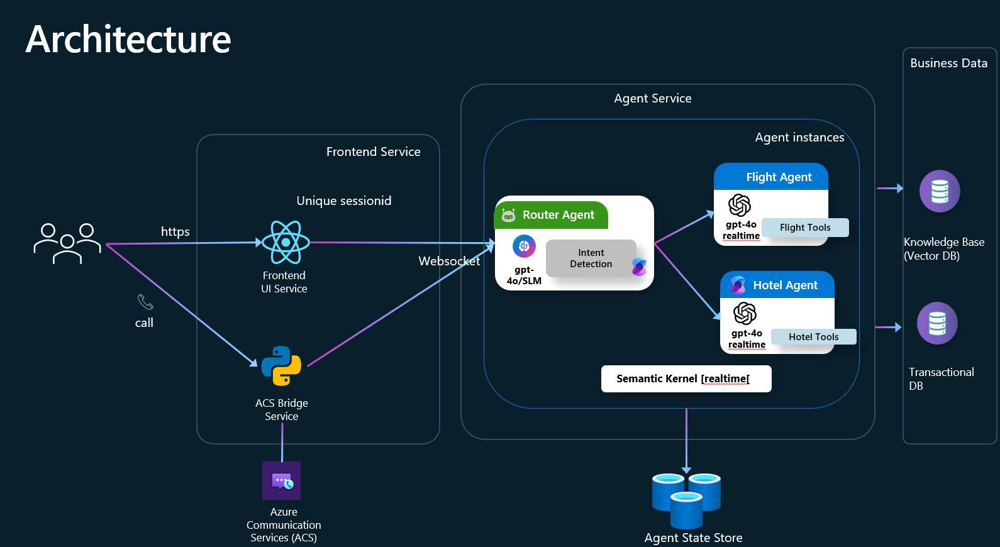

# Real-Time Multi-Agent Customer Service System  
  
This architecture enables seamless, real-time customer service experiences via web and telephony, orchestrating multiple specialized AI agents with robust state management and enterprise data integration.  
  
---  
  
## 1. High-Level Architecture Overview  



  
| Block                | Role                                                                                                             | Key Tech & Patterns                                                  |  
|----------------------|------------------------------------------------------------------------------------------------------------------|-----------------------------------------------------------------------|  
| **User Experience**  | Captures user speech/text and renders the agent’s reply instantly.                                               | - React + Vite Web UI <br> - WebSocket (realtime conversational UI)<br> - Azure Communication Services (ACS) for phone calls            |  
| **Frontend Service** | Manages unique session IDs across channels; bridges between users and agents.                                    | - Session management (UUID/callerID as session keys)<br> - HTTPS/WebSocket multiplexing                                                    |  
| **Agent Service**    | Runs a Router Agent for intent detection, orchestrates Domain Agents (Flight, Hotel, etc.), and manages state.   | - Semantic Kernel (SK)<br> - Azure OpenAI GPT-4o (realtime streaming)<br> - Multi-agent orchestration<br> - Real-time session manager     |  
| **Business Data**    | Provides durable data sources (knowledge base and transactional DB) for agent tools.                             | - SQL (transactions)<br> - Vector DB (searchable knowledge)                                              |  
| **Session State Store** | Persists session and chat history, enabling stateless horizontal scaling and resilience.                      | - In-memory (local demo)<br>- Redis (distributed/production)                                            |  
  
**Session Identity:**    
Every request—regardless of channel—is tied to a unique session ID (UUID for web, callerId for phone), ensuring context continuity and correct agent matching.  
  
---  
  
## 2. User Experience & Front-end Integration  
  
### 2.1 Web Interface  
  
- **React + Vite SPA:**  
  - Initiates a new session (`uuid4`) on conversation start.  
  - Establishes a persistent WebSocket to `/realtime?session_state_key={uuid}` for streaming audio and agent responses.  
  - Streams mic audio as base64-encoded PCM frames.  
  - Plays `response.audio.delta` tokens immediately for low-latency voice.  
  - Renders live transcriptions and any cited “grounding” sources from agent tools.  
  
### 2.2 Phone Interface (Azure Communication Services)  
  
- **ACS Bridge (acs_realtime.py):**  
  - Listens for incoming phone calls via Event Grid.  
  - Answers and streams mixed-mono audio to `/realtime` over WebSocket using the callerId as the session key.  
  - Forwards agent audio responses back to the caller; handles barge-in (interrupt) with StopAudio signaling.  
  
### 2.3 Session Lifecycle  
  
- **Session key is persistent** for the duration of the user interaction (browser tab or phone call).  
- **Session ends** cleanly when user disconnects/stops: triggers input_audio_buffer clear and session cleanup.  
  
---  
  
## 3. Agent Service Design  
  
### 3.1 Multi-Agent Orchestration (rtmt.py)  
  
- **Router Agent**  
  - Lightweight, always-on; performs `detect_intent()` on each new utterance.  
  - Decides which Domain Agent (e.g., Flight, Hotel) should handle the request.  
- **Domain Agents (Flight, Hotel, etc.)**  
  - Each has:  
    - A YAML persona prompt (templated with user details).  
    - Its own SK Kernel instance with specialized tools (function-calling enabled).  
    - Capabilities for both information lookup and transactional actions.  
  
### 3.2 In-Session Intent Switching  
  
- **Intent Detection** invoked on every transcript.  
- **If intent changes** mid-session:  
  - Flushes partial audio with `input_audio_buffer.clear`.  
  - Initializes the new Domain Agent’s kernel; preserves

    conversation history for seamless transfer.  
  - State flags (`transfer_conversation`, `active_response`) ensure only one agent responds at a time, preventing overlap or duplication.  
  
### 3.3 Tool Execution & Grounding  
  
- **Tools** are Python coroutines decorated with `@kernel_function` and exposed to LLMs via function-calling.  
- **Example tool functions:**  
  - `load_user_flight_info`, `check_flight_status` (SQL SELECT)  
  - `confirm_flight_change`, `confirm_reservation_change` (SQL UPDATE/INSERT)  
  - `search_*_knowledgebase` (vector search for top-k matching knowledge base chunks)  
- **Agent responses are grounded**: Agents must only cite facts retrieved by tools; if the relevant data is missing, agents return “I don’t know.”  
  
### 3.4 Real-Time WebSocket Loop  
  
- **Bidirectional streaming:**    
  - Client → backend: `input_audio_buffer.append` streams audio for Whisper transcription.  
  - Backend → client: `response.audio.delta` streams synthesized agent speech token-by-token.  
- **Concurrency:**    
  - Two asyncio tasks (`from_client_to_realtime`, `from_realtime_to_client`) ensure continuous, low-latency (<200ms per token) interactions.  
  
### 3.5 Session & Agent Instance Management  
  
- **Session Dict Structure:**    
  ```python  
  self.sessions[session_state_key] = {  
      current_agent, current_kernel, history,  
      target_agent_name, transfer_conversation,  
      active_response, realtime_settings,  
      customer_name, customer_id  
  }  
  ```
- **Chat history** is truncated to the last `n` turns using `ChatHistoryTruncationReducer` for prompt efficiency.  
- **SessionState locks** safeguard concurrent access (e.g., if multiple sockets connect for a single session), ensuring state consistency.  
  
---  
  
## 4. Business Data Layer  
  
| Store            | Content & Purpose                                      | Access Pattern                                            |  
|------------------|--------------------------------------------------------|-----------------------------------------------------------|  
| SQL DB           | Flights, reservations, payments, user records, etc.    | ACID RW via SQLAlchemy, used by agent tools under SK      |  
| Vector DB        | Policy and FAQ articles, embedded as vector chunks     | Top-k cosine similarity search via `search_*_knowledgebase`|  
  
- **Abstraction:**    
  - Business data access is **black-boxed** behind agent tools.    
  - Agents issue tool calls—never raw SQL/embedding queries—providing security, data integrity, and clear provenance.  
  - Enables easy migration between local JSON/SQLite and cloud-scale managed services.  
  
---  
  
## 5. Agent Session Store  
  
- **In-memory cache** for local single-instance runs.  
- **Redis-backed store** for distributed deployment, supporting:  
  - Stateless, non-sticky load-balancing.  
  - Session persistence and resumption after pod restarts or failures.  
- **Stores reduced chat history** (by default, last 3 turns), so any agent instance can resume a session seamlessly.  
  
---  
  
## 6. Scalability & Deployment Guidelines  
  
| Component       | Scaling Approach                                                                              |  
|-----------------|----------------------------------------------------------------------------------------------|  
| Front-End       | Static assets on CDN; unlimited horizontal scale.                                             |  
| ACS Bridge      | Stateless app; deploy multiple replicas (App Service/Container Apps).                        |  
| Agent Service   | Containerize (`rtmt.py`), deploy as multiple pods with Redis for session state.               |  
|                 | SK manages WebSocket/GPT-4o connections; throughput scales with Azure OpenAI deployments.     |  
| Transactional DB| Promote from SQLite (dev) to Azure SQL/PostgreSQL; use read replicas for high-QPS.            |  
| Vector DB       | Move from JSON/SciPy (local) to Azure AI Search, Pinecone, or Qdrant for horizontal scaling.  |  
| Model Traffic   | Multiple GPT-4o/-mini deployments; SK can load-balance transparently.                        |  
  
- **Design for Seamless Growth:**    
  The architecture scales gracefully from a single VM demo to a global, multi-region deployment with high-availability and auto-scaling, all without changes to the core code structure.  
  
---  
  
## 7. Key Architectural Strengths  
  
- **Multi-channel:** Supports both web and phone users with unified, context-aware agent service.  
- **Real-time & Low Latency:** Uses streaming WebSocket and token-by-token synthesis for sub-200ms response times.  
- **Intelligent Multi-Agent Routing:** Intent detection and on-the-fly agent transfer keep interactions efficient and relevant.  
- **Enterprise-Grade Data Security:** Agents access business data only through secure, audited tools; never direct queries.  
- **Robust State Management:** Redis-powered session store enables stateless scaling and resilience.  
- **Modular & Extensible:** New domain agents (Rail, Insurance, etc.) or business tools can be plugged in easily.  
  
---  
  
**This architecture combines the best of cloud-native, real-time interaction, secure AI orchestration, and practical scaling, making it ready for both quick prototyping and robust, enterprise deployments.**  