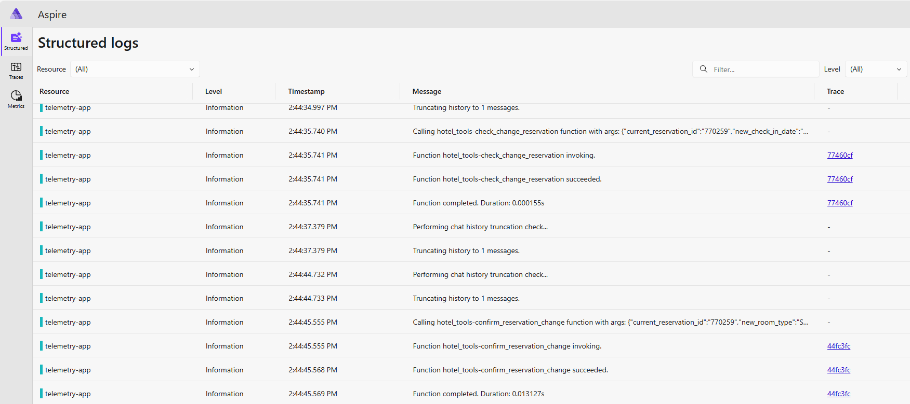

# Observe application behavior

## Semantic Kernel and Observability

It's worth taking a minute to read these two pages about observability with semantic kernel:
[Observability in Semantic Kernel](https://learn.microsoft.com/en-us/semantic-kernel/concepts/enterprise-readiness/observability)

## Observability Architecture

This application uses the [Open Telemetry](https://opentelemetry.io/) standard for shipping application tracing data to three telemetry destinations:
- [.NET Aspire Dashboard](https://learn.microsoft.com/en-us/dotnet/aspire/fundamentals/dashboard/overview?tabs=bash), an OTEL-based dashboard for viewing application behavior.
- [Application Insights](https://learn.microsoft.com/en-us/azure/azure-monitor/app/app-insights-overview), Azure's application observability service.
- Console log

## How does the app send telemetry data to observability destinations?

The application uses the python `opentelemetry` sdk to send data to various destinations. The sdk uses base classes `LogProvider`, `SpanProvider` and `MetricProvider` to send data to various endpoints. In [utility.py]('..\..\voice_agent\app\backend\utility.py) the application uses specific implementations of those classes to send telemetry data to the destinations.

## What observability resources are deployed to my resource group?

### Aspire Dashboard

The bicep infrastructure deploys Aspire Dashboard as a standalone ACA container called `aspire-dashboard`. You can find it in the list of resources in your resource group. Browse the dashboard by clicking the container link.

### Application Insights Resource

The bicep infrastructure deploys an Application Insights resource where you can observe your telemetry data. Use the following features to observe semantic kernel behavior in App Insights:

## Observe Application Behavior

### Conduct a conversation with the customer service agents

Conduct a conversation with the customer service agents following this sequence:
- Ask about your upcoming hotel stay
- Upgrade the room to a suite
- Ask about your upcoming flights
- Upgrade your seat to Business class

### Observe application behavior in Aspire Dashboard

- Go to your resource group in Azure Portal
- Click on the `aspire-dashboard` resource
- Click on the `Application URL` in the top right corner to navigate to the dashboard

- Observe the application log showing the conversation you conducted. Locate an entry: "Function hotel_tools-load_user_reservation_info invoking." and click on the Trace link. This navigates you to the Trace page for that function call.
- Observe the details of the trace, such as the duration and other metadata.

- Click on the Traces navigation on the left.
- Observe the sequence of function calls and confirm it matches the conversation you had. Drill into traces to see information as desired.

- Click on the Metrics navigation on the left.
- Click on the function duration metric to see the duration on the most recent function calls.

## Application Environment Variables

- You can disable specific OTEL destinations by adjusting the `TELEMETRY_SCENARIO` variable. By default it is `console,application_insights,aspire_dashboard`. You can remove any destination from the list by and re-deploy by this sequence:
    - Go to the `backend` ACA app
    - Click on containers
    - Click on Environment Variables
    - Adjust the value as desired
    - Click `Deploy as new revision`. This will deploy a new revision of the backend app with your new value.
---
#### Navigation: [Home](../../README.md) | [Previous Section](../02_setup/README.md) | [Next Section](../04_explore/README.md)